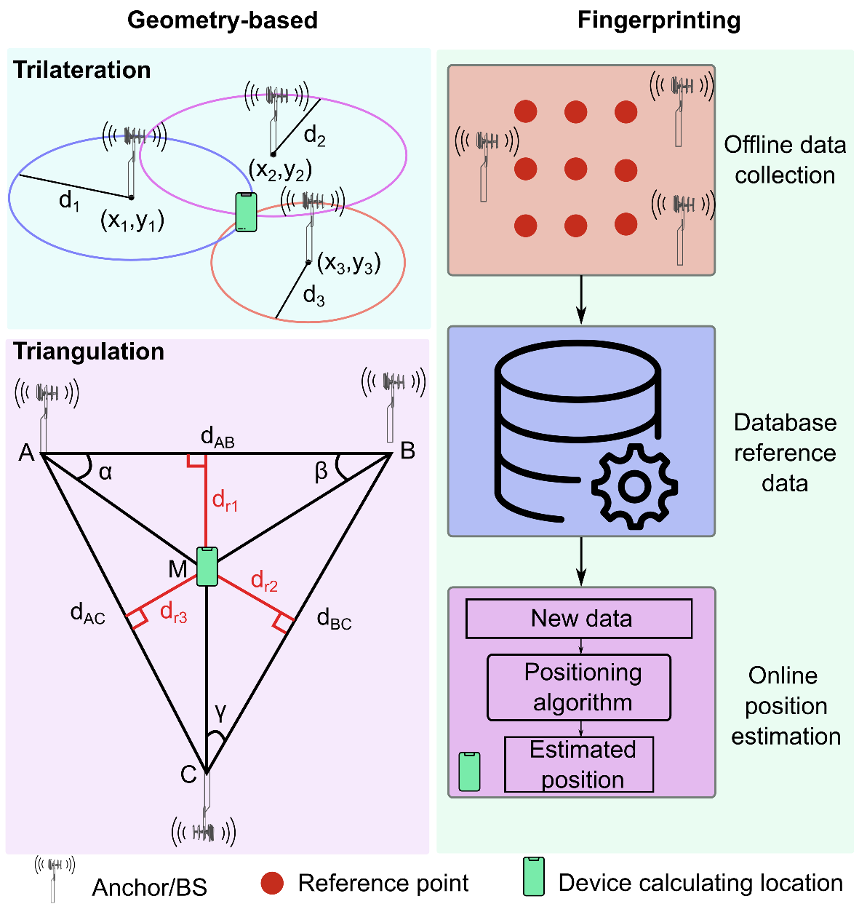

Are D2D and RIS in the Same League? Cooperative RSSI-based Localization Model and Performance Comparison
==================

This code package is related to the following article:

Nadezhda Chukhno, Sergio Trilles, Joaqu ́ın Torres-Sospedra, Antonio Iera, and Giuseppe Araniti, “[Are D2D and RIS in the Same League? Cooperative RSSI-based Localization Model and Performance Comparison]“ (link to be added) 

**Reproducible research.** The package contains a MATLAB simulation environment that reproduces some the numerical results and figures in the article. 

## Abstract

The next generation of high-accuracy positioning services is required to satisfy the sub-meter accuracy level for more than 95% of the network area, including indoor, outdoor, and urban deployments. In this vein, inter-agent measurements appear to provide additional position information and, hence, have the capacity to boost localization accuracy. This paper researches cooperative positioning techniques by means of device-to-device (D2D) and reconfigurable intelligent surfaces (RIS) technologies leveraging received signal strength (RSS) based ranging. We estimate the maximum capacities of the positioning systems in terms of accuracy through Gaussian noise model, proposed universal theoretical distance-dependent noise model, and empirical noise model. We also evaluate the positioning error achieved by combining two or more technologies. Numerical results reveal the use cases advantageous for RIS- and D2D-aided localization. Then, based on the results, valuable guidelines are derived on the optimal sensor fusion metric – median – that minimizes the mean error of the cooperative localization.

## Content of Code Package
1. [simulateFigure1.m](simulateFigure1.m) generates Fig. 1: SNR comparison of RIS and relays.

2. Fig. 2 is drawn in Inkscape:

3. [simulateFigure3.m](simulateFigure3.m) generates Fig. 3: LoS probability as a function of 2D distance between the BS and the MT according to 3GPP UMi Street Canyon model.

4. [simulateFigure4.m](simulateFigure4.m) generates Fig. 4: Visualisation of distance-dependent noise variances, 3GPP UMi Street Canyon LoS/nLoS.

5. Fig. 5 is drawn in Inkscape:

6. [simulateFigure6.m](simulateFigure6.m) generates Fig. 6:  Theoretical lower bounds, equal placement of RISs and relays. 

When running, select the folowing (equal placement of RISs and relays): Choose D2D user distribution? Options are 1,2,3,4: 3

7. [CRLB.m](CRLB.m) generates Table VI: Lower bounds, [m]. Results are shown in descending order of 95thPRC error. 

See instructions below for LoS scenario. This code generates theoretical lower bounds, such as Cramer–Rao lower bound (CRLB) for theoretical and experimental noise models for D2D, RIS, and cellular positioning systems.

8. [simulateFigure7.m](simulateFigure7.m) generates Fig. 7:  Visualisation of Gaussian noise probability density function.

9. Fig. 8(a,b,c) is generated by running [mainCode.m](mainCode.m) and Fig. 8d is generated by running [mainCode_median.m](mainCode_median.m)

**Figure 8 and Table VII can be generatied by running the code with the parameters as explained in the instructions below, or by running the following script that reads saved data (pregenerated)**

[CreateFigure8a.m](CreateFigure8a.m)

[CreateFigure8b.m](CreateFigure8b.m)

[CreateFigure8c.m](CreateFigure8c.m)

[CreateFigure8d.m](CreateFigure8d.m)

**Instructions**:

- to generate Fig. 8(b) (LoS, random placement of relays within 100 m x 100 m) the following parameters should be inserted:
    
`Enter number of evaluation points (M):` 30

`Enter number of experiment repetitions (rep):` **1000**

*Note that just for testing rep=10 is enought to see the trend*

`Choose D2D user distribution? Options are 1,2,3,4:` 1

`CELLULAR setup: Enter real non-blocked/blocked path (32.4/47.4):` 32.4

`CELLULAR setup: Enter estimated non-blocked/blocked path (32.4/47.4):` 32.4

`CELLULAR setup: Enter real PLE LOS/NLOS (2.1/3.19):` 2.1

`CELLULAR setup: Enter estimated PLE LOS/NLOS (2.1/3.19):` 2.1

`RIS setup: Enter real non-blocked/blocked path (32.4/47.4):` 32.4

`RIS setup: Enter estimated non-blocked/blocked path (32.4/47.4):` 32.4

`RIS setup: Enter real PLE LOS/NLOS (2.1/3.19):` 2.1

`RIS setup: Enter estimated PLE LOS/NLOS (2.1/3.19):` 2.1

`D2D setup: Enter real non-blocked/blocked path (32.4/47.4):` 32.4

`D2D setup: Enter estimated non-blocked/blocked path (32.4/47.4):` 32.4

`D2D setup: Enter real PLE LOS/NLOS (2.1/3.19):` 2.1

`D2D setup: Enter estimated PLE LOS/NLOS (2.1/3.19):` 2.1

Files  [trilateration_estimation.m](trilateration_estimation.m), [estimate_distance.m](estimate_distance.m), and [circles.m](circles.m) are available under MIT License, Copyright (c) 2022 Joao Dias. 
[Available here](https://github.com/joaodias/WiFi-RSS-based-trilateration-with-MATLAB)

- to generate Fig. 8(c) (LoS, random placement of relays within circle of 20 m radius) the following parameters should be inserted:

`Enter number of evaluation points (M):` 30

`Enter number of experiment repetitions (rep):` 1000

`Choose D2D user distribution? Options are 1,2,3,4:` **2**

*The rest parameters are the same as for Fig. 6(b).*

- to generate Fig. 8(a) the following parameters should be inserted:
`Choose D2D user distribution? Options are 1,2,3,4:` **3**

*The rest parameters are the same as for Fig. 6(b).*

- to generate Fig. 8(d), [mainCode_median.m](mainCode_median.m) should be lanched with the following parameters:

`Enter number of evaluation points (M):` 30

`Enter number of experiment repetitions (rep):` 10

`Choose D2D user distribution? Options are 1,2,3,4:` 1

`CELLULAR setup: Enter real non-blocked/blocked path (32.4/47.4):` 32.4

`CELLULAR setup: Enter estimated non-blocked/blocked path (32.4/47.4):` 32.4

`CELLULAR setup: Enter real PLE LOS/NLOS (2.1/3.19):` **3.19**

`CELLULAR setup: Enter estimated PLE LOS/NLOS (2.1/3.19):` **3.19**

`RIS setup: Enter real non-blocked/blocked path (32.4/47.4):` 32.4

`RIS setup: Enter estimated non-blocked/blocked path (32.4/47.4):` 32.4

`RIS setup: Enter real PLE LOS/NLOS (2.1/3.19):` 2.1

`RIS setup: Enter estimated PLE LOS/NLOS (2.1/3.19):` 2.1

`D2D setup: Enter real non-blocked/blocked path (32.4/47.4):` 32.4

`D2D setup: Enter estimated non-blocked/blocked path (32.4/47.4):` 32.4

`D2D setup: Enter real PLE LOS/NLOS (2.1/3.19):` **3.19**

`D2D setup: Enter estimated PLE LOS/NLOS (2.1/3.19):` **3.19**

*To reduce the running time, runs=1000 can be reduced.*

## Acknowledgements

The authors gratefully acknowledge funding from European Union’s Horizon 2020 Research and Innovation programme under the Marie Sklodowska Curie grant agreement No. 813278 (A-WEAR: A network for dynamic wearable applications with privacy constraints, http://www.a-wear.eu/).

## Referencing

If you in any way use this code for research that results in publications, please cite our original article listed above.